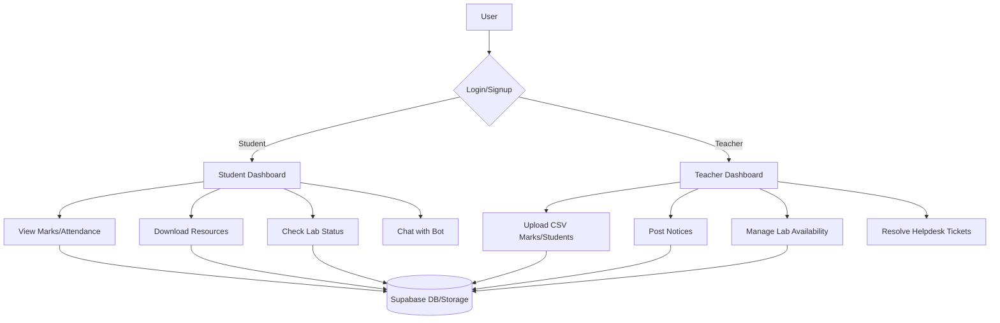
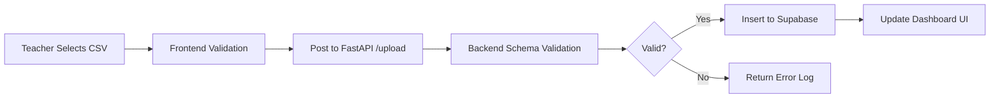

# CHAPTER 3: IMPLEMENTATION OF PROPOSED METHOD/MODEL/ALGORITHM

## 3.1 SOFTWARE REQUIREMENT SPECIFICATION (SRS)

### 3.1.1 Introduction
The Academic Infrastructure Management System (AIMS) is a centralized platform designed to streamline administrative and academic processes within an educational institution. It provides dedicated interfaces for students, faculty, and administrators to manage resources, monitor performance, and facilitate communication.

### 3.1.2 Functional Requirements
1.  **User Authentication:** Secure login and signup for Students and Teachers with role-based access control (RBAC).
2.  **Student Dashboard:**
    *   **Digital ID Card:** Real-time generation and photo management.
    *   **Academic Records:** Viewing unit test marks and semester results.
    *   **Resource Center:** Accessing department-specific study materials and timetables.
    *   **Lab Management:** Real-time availability tracking and booking requests.
    *   **Helpdesk:** Ticket submission and tracking for complaints/queries.
3.  **Teacher Dashboard:**
    *   **Student Management:** Bulk upload of student lists via CSV.
    *   **Academics:** CSV-based marks uploading and subject configuration.
    *   **Information Broadcast:** Posting notices and uploading timetables.
    *   **Lab Control:** Toggling lab availability status.
4.  **Intelligent Chatbot:** Keyword-based fuzzy matching system to provide quick answers and video-based navigation guides.

### 3.1.3 Non-Functional Requirements
1.  **Scalability:** Ability to handle increasing numbers of students and data records using Supabase.
2.  **Performance:** Fast response times for data retrieval and file uploads.
3.  **Security:** Row-Level Security (RLS) on database tables and secure JWT-based authentication.
4.  **Usability:** A modern, responsive UI built with Next.js and Tailwind CSS for cross-device compatibility.

### 3.1.4 Software & Hardware Requirements
*   **Frontend:** Next.js 14, React, Tailwind CSS, Lucide Icons.
*   **Backend:** Python FastAPI, RapidFuzz (for Chatbot), CSV Processor.
*   **Database:** Supabase (PostgreSQL), Supabase Auth, Supabase Storage.
*   **Tools:** VS Code, Git, Bun/NPM, Uvicorn.

---

## 3.2 FLOW CHART

### 3.2.1 System Overview Flow


### 3.2.2 CSV Upload Process Flow


---

## 3.3 ALGORITHM

### 3.3.1 Chatbot Fuzzy Matching Algorithm
The chatbot uses the **RapidFuzz** library to match user queries against a predefined knowledge base (`chatbotData.json`).

**Steps:**
1.  **Pre-processing:** Normalize user input (lowercase, remove special characters).
2.  **Tokenization:** Split query and keywords into individual tokens.
3.  **Scoring:**
    *   Calculate `token_set_ratio` between user query and FAQ keywords.
    *   Calculate `partial_ratio` between user query and FAQ questions.
4.  **Selection:** 
    *   If `max(score) >= Threshold (60)`, return the answer with the highest score.
    *   Else, return the `defaultResponse`.
5.  **Navigation:** If a video guide is linked, return the `video_url` for frontend rendering.

### 3.3.2 CSV Validation and Data Transformation
**Steps:**
1.  **Upload:** Receive `multipart/form-data` file in FastAPI.
2.  **Parsing:** Read CSV content using Python `csv` module or `pandas`.
3.  **Validation:** 
    *   Check for mandatory columns (`roll_no`, `subject`, `marks`).
    *   Verify data types (e.g., `marks` must be an integer between 0 and 100).
    *   Check for duplicate `roll_no` entries in the batch.
4.  **Sync:** Batch insert valid records into the Supabase PostgreSQL table using the Supabase Python Client.
5.  **Logging:** Return a JSON response with counts of `inserted` and `failed` rows, including specific error messages for failed rows.

---

## 3.4 CODING

### 3.4.1 Backend: CSV Processing (FastAPI)
```python
# backend/csv_processor.py snippet
def process_unit_test_csv(file_content):
    results = {"inserted": 0, "failed": 0, "errors": []}
    reader = csv.DictReader(file_content.decode().splitlines())
    
    for row in reader:
        try:
            # Data Validation
            roll_no = row['roll_no']
            marks = int(row['marks'])
            
            # Database Insertion
            supabase.table('unit_test_marks').insert({
                "roll_no": roll_no,
                "subject": row['subject'],
                "marks": marks,
                "semester": row['semester']
            }).execute()
            results["inserted"] += 1
        except Exception as e:
            results["failed"] += 1
            results["errors"].append(f"Row {row.get('roll_no')}: {str(e)}")
            
    return results
```

### 3.4.2 Frontend: Lab Status Component (Next.js)
```tsx
// src/api/labs.ts
export const toggleLabStatus = async (labId: string, isOpen: boolean) => {
  const { data, error } = await supabase
    .from('labs')
    .update({ status: isOpen ? 'Open' : 'Closed' })
    .eq('id', labId);
    
  if (error) throw error;
  return data;
};

// UI Usage in Teacher Dashboard
const handleToggle = async (id: string, currentStatus: string) => {
  const newStatus = currentStatus === 'Open' ? false : true;
  await toggleLabStatus(id, newStatus);
  // Update local state to reflect change
};
```

### 3.4.3 Database Schema (SQL)
```sql
-- Students Table
CREATE TABLE students (
  id UUID PRIMARY KEY DEFAULT uuid_generate_v4(),
  roll_no TEXT UNIQUE NOT NULL,
  name TEXT NOT NULL,
  branch TEXT NOT NULL,
  year TEXT NOT NULL,
  photo_url TEXT
);

-- Marks Table
CREATE TABLE unit_test_marks (
  id BIGINT PRIMARY KEY GENERATED ALWAYS AS IDENTITY,
  roll_no TEXT REFERENCES students(roll_no),
  subject TEXT NOT NULL,
  marks INTEGER,
  semester TEXT,
  created_at TIMESTAMPTZ DEFAULT NOW()
);
```
